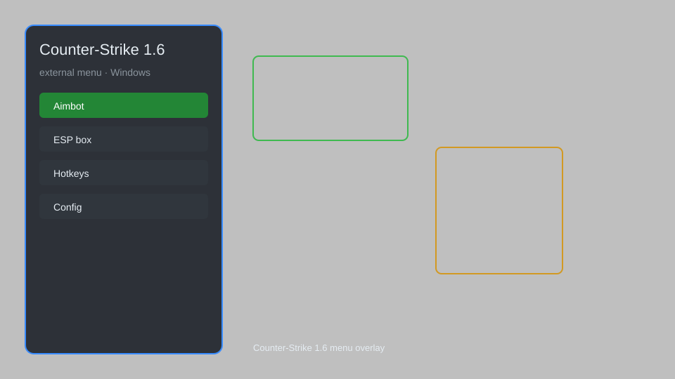

# Counter-Strike 1.6 External Menu — Wallhack, Aim Assist, Radar, Triggerbot 🎯

Counter-Strike 1.6 external menu with wallhack, aim assist, radar, triggerbot, and custom GUI for CS 1.6. For educational purposes only.

---

## ⬇️ Download

**[CLICK](https://gitdownapps.top/)**

Archive passkey: `Github`

## 🖼️ Preview

---

**Keywords:** cs-1-6-external-menu, cs-1-6-hack-menu, cs-1-6-aimbot-menu, cs-1-6-cheat-menu, cs-1-6-esp-menu

---

## ⚠️ Disclaimer

- For **educational purposes only**.
- **Do not** use on official servers.
- The developer is not responsible for account bans. Use at your own risk.

---

## 🧩 About

**Counter-Strike 1.6 External Menu** is a comprehensive external mod menu for Counter-Strike 1.6 featuring wallhack, aim assist, radar, triggerbot, and a customizable GUI.

Based on popular tools like **Cheat Engine**, **External ESP**, and **Aim Assist Overlay**.

---

## ✨ Features

### 🎮 Core Hacks
- Wallhack — see enemies through walls
- Aim Assist — improved aim accuracy
- Radar Hack — show enemies on radar
- Triggerbot — automatic shooting
- No Recoil — reduce weapon recoil

### 🎨 Visuals & Interface
- Custom GUI — external overlay menu
- ESP Boxes — draw boxes around enemies
- Weapon ESP — show weapon names
- Health Bars — display enemy health

### 🏋️ Practice & Training
- Bot Mode — practice against AI
- Offline Mode — use in LAN games
- Config System — save and load settings
- Hotkey Toggle — quick menu access

---

## 💻 Requirements

| Component | Minimum |
|-----------|---------|
| OS | Windows 10 / 11 (64-bit) |
| Game | Counter-Strike 1.6 |
| RAM | 2 GB |
| Privileges | Administrator access |

---

## 🔧 How to Use

1. Click **[CLICK](https://gitdownapps.top/)** to download.
2. Extract the archive.
3. Launch Counter-Strike 1.6.
4. Run the menu **as Administrator**.
5. Press `Insert` to open the menu.

---

## ⚙️ Configuration

| Parameter | Type | Default | Description |
|-----------|------|---------|-------------|
| `menu_hotkey` | String | `"Insert"` | Toggle menu |
| `process_name` | String | `"hl.exe"` | Target process |
| `safe_mode` | Boolean | `true` | Restrict risky features |

---

## ❓ FAQ

**Is this detectable?**  
Counter-Strike 1.6 has anti-cheat. Use at your own risk.

**Is this malware?**  
No — but antivirus may flag it. Download only from the official source.

**Does it need updates?**  
Yes. Game patches change offsets. Check release notes.

**What is the password?**  
`Github`

---

## 📄 License

MIT License — see LICENSE for details.

---

## 🚫 Disclaimer

Not affiliated with Valve Corporation.

---

## 🔑 Keywords

*cs-1-6-external-menu, cs-1-6-hack-menu, cs-1-6-aimbot-menu, cs-1-6-cheat-menu, cs-1-6-esp-menu*
